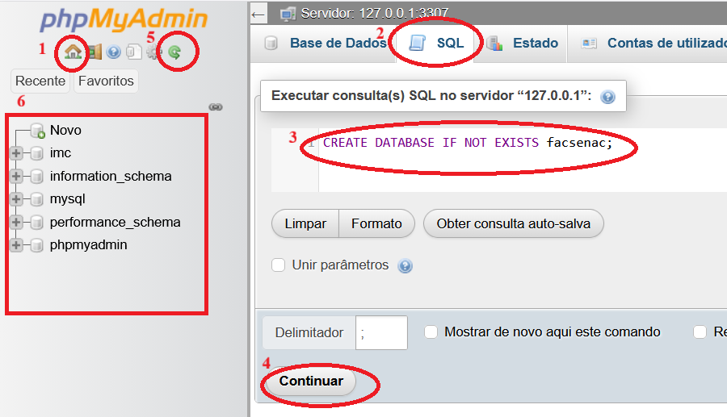

# Criar database no MySQL usando PHPMyAdmin
  
  
Siga a sequência indicada na figura acima:
1. Clique no ícone da casa para ver o menu de `Base de Dados`
2. Clique no menu na opção `SQL` 
3. Digite a instrução SQL abaixo:
```
CREATE DATABASE IF NOT EXISTS `facsenac` 
```
4. Clique no botão `Continuar` para executar a instrução.
5. Clique no ícone da seta curva para atualizar a relação de bancos de dados (schemas). 
6. Deve aparecer o schema `facsenac`.
  
Se clicar no nome do database `facsenac` poderá clicar na opção `SQL` no topo do menu a esquerda para poder digitar outros comandos SQL, como, por exemplo: 
```
SELECT * FROM usuarios;
```