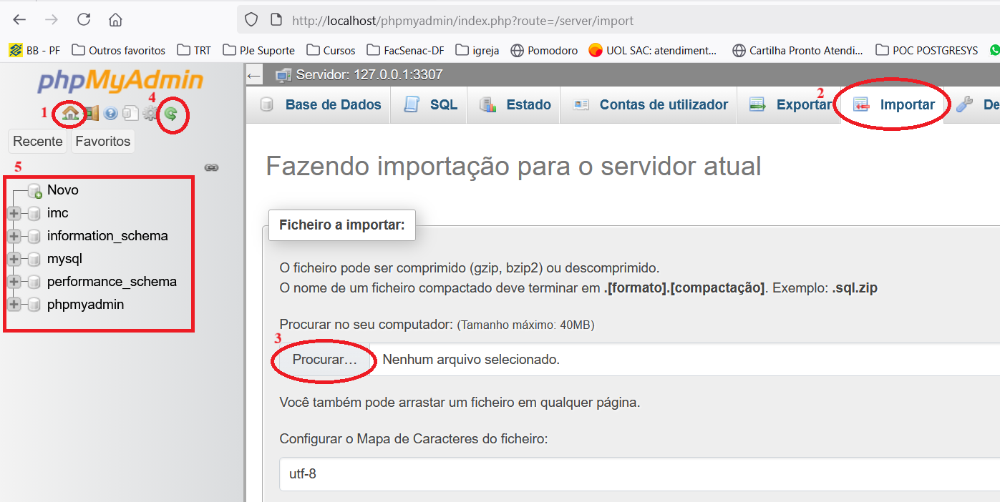

# Criar database no MySQL com script fornecido no projeto no PHPMyAdmin
  
  
Siga a sequência indicada na figura acima:
1. Clique no ícone da casa para ver o menu de `Base de Dados`
2. Clique no menu na opção `Importar` 
3. Clique em `Procurar...` para localizar o arquivo `database-facsenac.sql` dentro da pasta `banco-de-dados` no repositório deste projeto. Depois clique no botão `Importar` que fica um pouco abaixo na página .
4. Clique no ícone da seta curva para atualizar a relação de bancos de dados (schemas). 
5. Deve aparecer o schema `facsenac`.
  
Se clicar no nome do database `facsenac` poderá clicar na opção `SQL` no topo do menu a direita para poder digitar outros comandos SQL, como, por exemplo: 
```
SELECT * FROM usuarios;
```