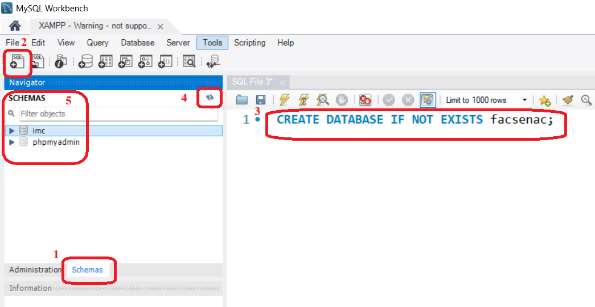

# Criar database no MySQL usando Workbench
  
  
Siga a sequência indicada na figura acima:
1. Clique na palavra `Schemas` para ver a lista de schemas existentes.
2. Clique no primeiro ícone (com sinal de `+` e a palavra `SQL` )
3. No lado direito, na nova aba que se abriu, digite a instrução SQL abaixo:
```
CREATE DATABASE IF NOT EXISTS `facsenac` 
```
Clique no ícone do raio para executar a instrução.  
4. Clique no ícone das duas setas curvas para atualizar a relação de schemas.  
5. Deve aparecer o schema `facsenac`.

  
Se clicar com o botão direito do mouse sobre o nome do schema `facsenac` aparecerá a opção `set as default schema`. Use essa opção para selecionar esse schema para poder efetuar outros comandos SQL nele, como, por exemplo: 
```
SELECT * FROM usuarios;
```