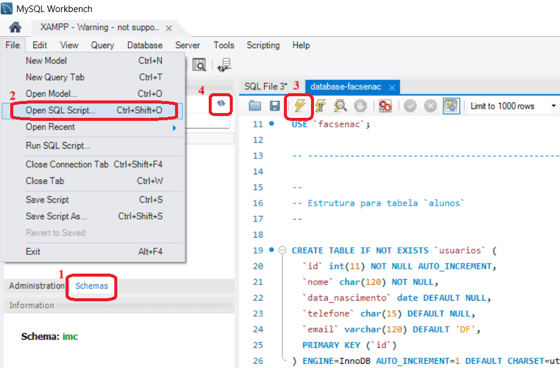

# Criar database no MySQL com script fornecido no projeto no Workbench
  
  
Siga a sequência indicada na figura acima:
1. Clique na palavra `Schemas` para ver a lista de schemas existentes.
2. Clique no menu `File` e escolha a opção `Open SQL Script...`
3. Após o script ser carregado, clique no ícone do raio para executar as instruções. Na parte de baixo da tela irá aparecer o resultado da execução de cada comando.
4. Clique no ícone das duas setas curvas para atualizar a relação de schemas. Deve aparecer o schema `facsenac`.

Se clicar com o botão direito do mouse sobre o nome do schema `facsenac` aparecerá a opção `set as default schema`. Use essa opção para selecionar esse schema para poder efetuar outros comandos SQL nele, como, por exemplo: 
```
SELECT * FROM usuarios;
```